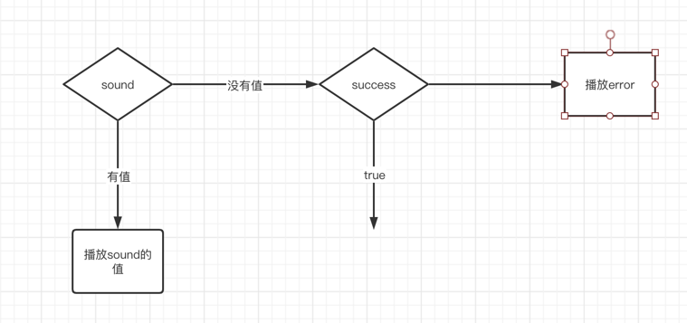

# 7-3

- 8888
- 111111

1. ~~PDA增加出库选择“运输方式”，生成的货运单按出库时选的运输方式计价~~
2. ~~PDA增加“异常件处理”，留包（截件、滞包）和转发快递 等异常件的处理~~
    - ~~使用扫描的列表解析 - 确定~~
3. ~~一票多件的下单（设置件数限制 如：10件以内需1个条码对应1包货下单、10及以上的件数可以只扫一个条码更改件数下单）及一票多件的条码打印~~
    - ~~demo WLTDP062813120863 两张~~
    - ~~则：WLTDP062813120863-1~~
    - ~~则：WLTDP062813120863-2~~
4. PDA合包称重、拼包 增加语音播报和包裹明细
5. ~~扫描改成列表 - 确定---理解错误~~

# 6-16

1. ~~PDA扫码入库没有声音播报~~
2. ~~已揽件要改为揽件~~
3. ~~最晚取件时间按最先下单档口从上往下排~~
4. 揽件增加一键领取功能
5. ~~打印出来的标签时间不对，应该是实际揽收时间~~
6. ~~打包改为合包~~
7. ~~合包 ：生成 打印 合包 改为 生成 合包（只称重不打印）、打印（称重并打印）~~
8. ~~合包：未选择包装袋，重量为0时，不能合包，提示请称重~~
9. ~~拼包：点开后标头还没改，合包号也要改为拼包号，没有显示拼包号时不能扫合包号~~
10. ~~拼包：生成 打印 集包改为生成 拼包（不打印）、打印（打印）~~
11. 拆包：扫完合包和拼包号，下面显示里面的详细订单号，点确定拆包后 提示拆包成功
12. ~~已揽列表，状态选项，改成全部，未入库，已入库~~
13. 打印机是特征没有获取到，所以超时。
    

1. ~~PDA已揽收列表打开无记录~~
2. ~~PDA打印机连接成功后，打开任何操作界面都会提示未连接打印机~~

3. ~~进入公众号有注册登陆过的下次直接跳过登陆界面直接可以下单 h5~~

4. ~~已揽件订单总件数汇总和明细，可按日期查询一个星期历史记录 st et~~
5. ~~合包称重：默认称重，无重量不能入库（按纤袋规格的除外）~~
6. ~~改名字：合包改为打包 集包改拼包~~
7. ~~蓝牙连接问题~~

8. ~~拼包操作，不需要 称重 和 选择 包装袋，也不用检测蓝牙秤~~
9. ~~合包（合包）操作，选择包装袋接口有调整，会带出来价格，选中包装袋之后，在选择价格，一起提交~~
11. ~~蓝牙界面的蓝牙数量过多无法滑动~~
10. ~~公众号下单地址删除后下次下单还是会默认之前的地址 h5~~

合包功能设计

用户小王,他会选责那些地区(每一个条码对应一个地区), 他会开始分拣, 等到a包裹,装满,然后他就可以点击提交,对a包裹进行合包操作.出一个条码.

--------------------------------------------

请求接口 = 返回条码 他去定义这个条码是装什么类型的货物

如果货物装错,就语音提示. 并且清空已经输入的两个二维码.

.....

某一个装满.

提交第一步生成的sn给你

在打印完整条码.

每一个包裹的操作:

生成新条码

合包-----提示框

两个文本框

一个输入框

包裹个数,重量,价格,

tips:提交的时候必须输入价格,默认值有系统给的,如果不修改也可以提交.

车辆下拉框 -显示车牌号

扫一下
